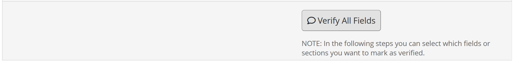
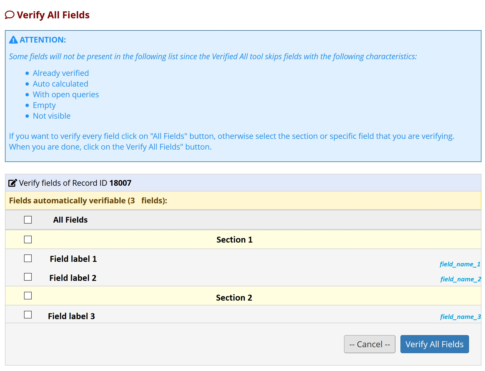

# verify_all
A REDCap module to allow verifying all fields at once.

How to use the verify all fields:

Using the module
<ul>
    <li>Enable the module for your project.</li>
    <li>Make sure you have data resolution workflow enabled.</li>
    <li>Give users the necessary rights.</li>
    <li>The verify all button only shows for saved records.</li>
    <li>Records that have history (i.e. that have been deverified or that have a query) will be skipped.</li>
</ul>
                    If all the above conditions are met you should be able to see the 'Verify all' button. 
                    If you don't understand why a user doesn't see the 'Verify all' button you can enable the debug button in the project settings of the module.
                      
                    Once you've clicked on 'Verify all' button you should see a list of fields that can be verified and you should be able to select each one or all and than set they as verified.
                     
                    
                     
                    Fields that can not be verified are:
                    <ul>
                        <li>Fileds just verified;</li>
                        <li>Fields with open queries;</li>
                        <li>Fields calculate;</li>
                        <li>Fields with @HIDDEN or @NOVERIFYALL tag;</li>
                        <li>Fields empty;</li>
                        <li>Redcap fields "record_id" and "<< instrument >>_complete";</li>
                    </ul>
                    
                

            

